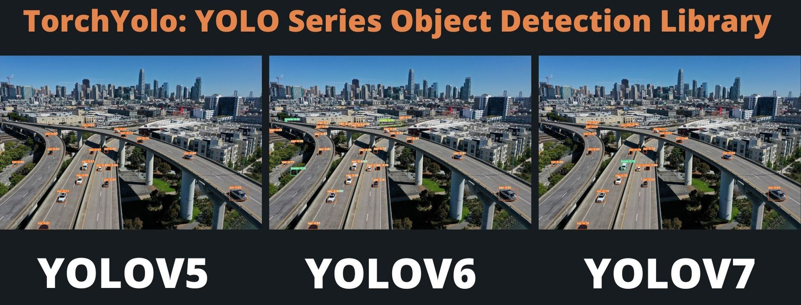

<div align="center">
<h4>
  
<div>
    <a href="https://pepy.tech/project/torchyolo"></a>
    <a href="https://badge.fury.io/py/torchyolo"></a>
    <a href="https://huggingface.co/spaces/kadirnar/torchyolo"></a>
</div>
</div>


### Introduction

The TorchYolo library aims to support all YOLO models(like YOLOv5, YOLOv6, YOLOv7, YOLOv8, YOLOX, etc.) and provide a unified interface for training and inference. The library is based on PyTorch and is designed to be easy to use and extend.

### Installation 
```bash
pip install torchyolo
```
### Usage
```python
from torchyolo import YoloHub
predictor = YoloHub(
  model_type="yolov5", 
  model_path="yolov5s.pt", 
  device='cpu', 
  image_size=640
)
predictor.conf_thres = 0.25
predictor.iou_thres = 0.45
predictor.save = True
predictor.show = False
image = "data/highway.jpg"
result = predictor.predict(image)
# Yolov6
result = predictor.predict(image, class_names="coco.names")
```

# Contributing
Before opening a PR:
  - Install required development packages:
    ```bash
    pip install -r requirements-dev.txt
    ```
  - Reformat the code with black and isort:
    ```bash
    bash script/code_format.sh
    ``` 

### Acknowledgement
A part of the code is borrowed from [SAHI](https://github.com/obss/sahi). Many thanks for their wonderful works.

### Citation
```bibtex
@article{li2022yolov6,
  title={YOLOv6: A single-stage object detection framework for industrial applications},
  author={Li, Chuyi and Li, Lulu and Jiang, Hongliang and Weng, Kaiheng and Geng, Yifei and Li, Liang and Ke, Zaidan and Li, Qingyuan and Cheng, Meng and Nie, Weiqiang and others},
  journal={arXiv preprint arXiv:2209.02976},
  year={2022}
}
```
```bibtex
@article{wang2022yolov7,
  title={{YOLOv7}: Trainable bag-of-freebies sets new state-of-the-art for real-time object detectors},
  author={Wang, Chien-Yao and Bochkovskiy, Alexey and Liao, Hong-Yuan Mark},
  journal={arXiv preprint arXiv:2207.02696},
  year={2022}
}
```
```bibtex
 @article{yolox2021,
  title={YOLOX: Exceeding YOLO Series in 2021},
  author={Ge, Zheng and Liu, Songtao and Wang, Feng and Li, Zeming and Sun, Jian},
  journal={arXiv preprint arXiv:2107.08430},
  year={2021}
}
```
```bibtex
@software{glenn_jocher_2020_4154370,
  author       = {Glenn Jocher and,Alex Stoken and,Jirka Borovec and,NanoCode012 and,ChristopherSTAN and,Liu Changyu and,Laughing and,tkianai and,Adam Hogan and,lorenzomammana and,yxNONG and,AlexWang1900 and,Laurentiu Diaconu and,Marc and,wanghaoyang0106 and,ml5ah and,Doug and,Francisco Ingham and,Frederik and,Guilhen and,Hatovix and,Jake Poznanski and,Jiacong Fang and,Lijun Yu 于力军 and,changyu98 and,Mingyu Wang and,Naman Gupta and,Osama Akhtar and,PetrDvoracek and,Prashant Rai},
  title={{ultralytics/yolov5: v7.2 - Bug Fixes and 
                   Performance Improvements}},
  month= oct,
  year= 2020,
  publisher= {Zenodo},
  version= {v3.1},
  doi= {10.5281/zenodo.4154370},
  url= {https://doi.org/10.5281/zenodo.4154370}
}
```
